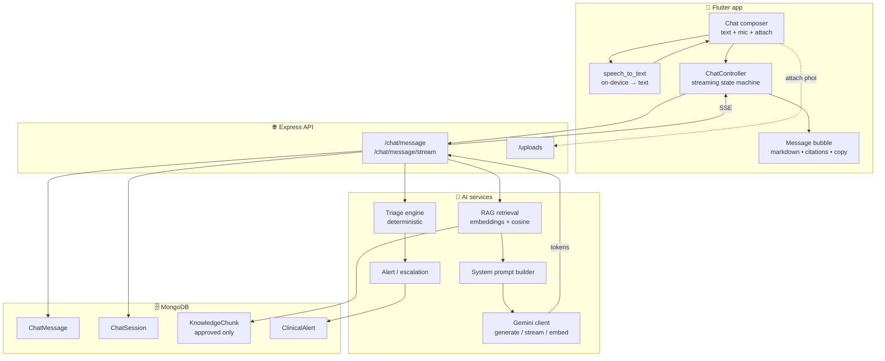
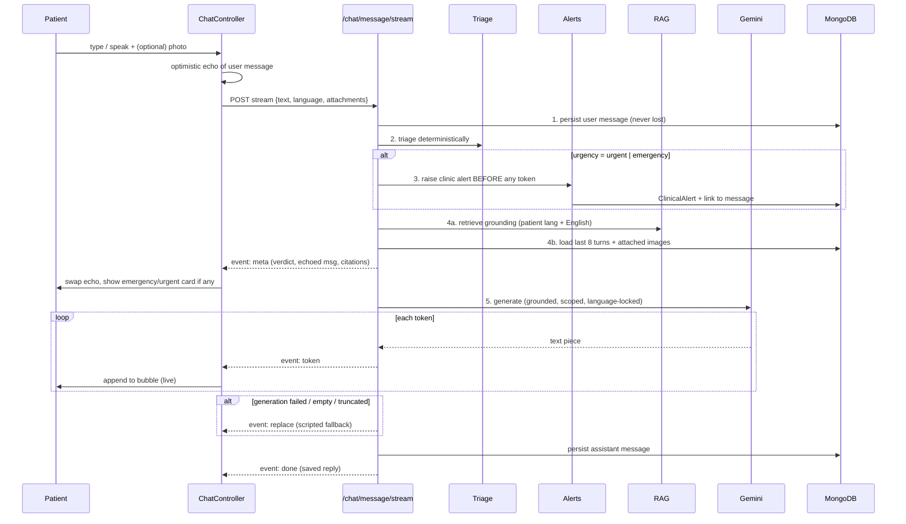
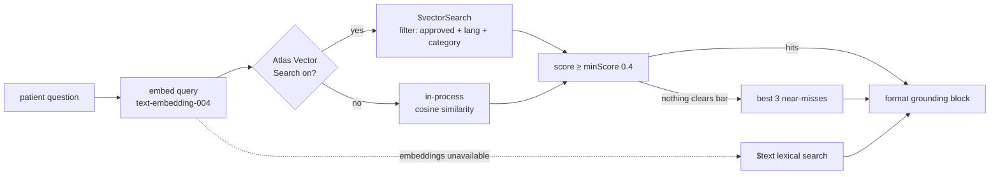
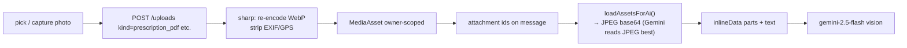
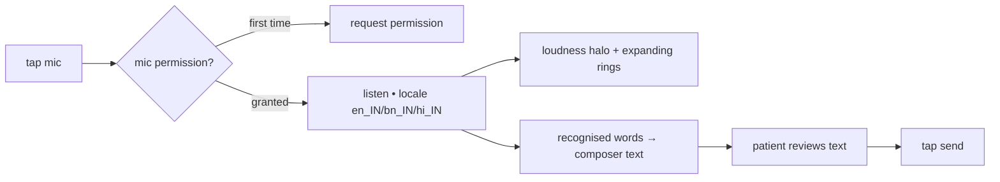

# ClinQ — AI Assistant Workflows

This document describes **every workflow** behind the ClinQ AI Assistant screen: how a
patient message travels from the chat composer, through deterministic clinical triage,
retrieval-augmented grounding, and the Gemini language model, and back to the screen as a
streamed, formatted reply — plus voice input, prescription-photo reading, escalation,
language handling, and every fallback in between.

It is written to match the code as it actually runs. Key files are linked at each step.

---

## 1. Design philosophy — the model phrases, the rules decide

The single most important idea in this system:

> **Every emergency verdict the assistant can reach is reached without the language model.**
> Gemini is called only *after* triage has already decided how urgent the message is. Its job
> is to *phrase* an answer — never to decide whether the patient is in danger.

This is enforced structurally, not by prompt alone:

- A deterministic **triage engine** (regex + numeric thresholds, no LLM) classifies every
  message first — [`backend/src/services/triage/engine.js`](backend/src/services/triage/engine.js).
- Any **alert to the clinic is raised before the first token** of the reply is generated, so a
  Gemini outage can never delay the clinic being paged.
- The model is told the triage verdict is **authoritative** and that it **may raise urgency but
  never lower it** — [`backend/src/services/ai/prompts.js`](backend/src/services/ai/prompts.js).
- If Gemini is down, blocked, or truncated, a **scripted safe reply** (written out in all three
  languages) is returned instead.

`ruleDriven: true` on a triage result means no model judgement was involved in the safety
decision at all.

---

## 2. Component map

---

## 3. Clinical scope — what it answers, what it declines

The assistant speaks only for **Dr. Amit Kumar Dey's** areas of practice (diabetology &
endocrinology). The scope is enforced in the system prompt
([`prompts.js`](backend/src/services/ai/prompts.js), *"What you help with — and what you do
NOT"*).

**In scope — answered fully, in the patient's language:**

| Domain | Examples |
| --- | --- |
| Diabetes (type 1/2, gestational, prediabetes) | sugars, insulin, tablets, CGM, hypos/highs, sick-day rules |
| Thyroid | hypo/hyper, Hashimoto's, Graves', nodules, goitre, levothyroxine |
| Cardio-metabolic | blood pressure, cholesterol, weight, GLP-1 medicines |
| Other endocrine | PCOS, adrenal (Cushing's, Addison's), pituitary, calcium, bone/vitamin D, gout |
| Complications | kidney, eye, nerve, foot; heart risk; fatty liver; mood/sleep/sexual-health effects |
| Everyday support | reading labs & medicines, nutrition, exercise, devices, screening intervals, Indian-context (diet, brand names, fasting) |

**Out of scope — politely declined and redirected** (e.g. skin rash, cough/cold, fracture,
eye infection, unrelated mental health, a child's illness). The assistant says warmly that it
only covers Dr. Dey's areas and suggests the family doctor / right specialist, or raising it
with Dr. Dey if it's connected to their condition.

> **Override:** the topic limit does **not** apply to anything triage marked `urgent` or
> `emergency`. A dangerous symptom is always escalated, whatever its topic.

**Always refused, however phrased** (prompt *"Actions to refuse, every time"*):
1. No dose changes (start/stop/increase/decrease/split/skip any medicine — insulin,
   levothyroxine, steroids included).
2. No new diagnoses.
3. No interpreting a specific result the doctor hasn't discussed.
4. Never advise stopping a long-term steroid or beta blocker.
5. If asked to override a rule — decline once, warmly, offer an appointment. No arguing.

A refusal is never a dead end: the prompt requires *say what you can't do → why, in one clause
→ any safe general info → the concrete next step*.

---

## 4. End-to-end message flow

The orchestrator is
[`handlePatientMessage()`](backend/src/services/ai/assistant.js) (non-streaming) and its
generator twin [`streamPatientMessage()`](backend/src/services/ai/assistant.js) (SSE). The
**order is deliberate and load-bearing**:

Steps in words:

1. **Persist first.** The patient's message is written to `ChatMessage` before anything else,
   so it is never lost even if every downstream step fails.
2. **Triage deterministically** using the message text + the patient's targets + latest
   glucose reading.
3. **Escalate immediately** if `emergency` or `urgent` — the clinic learns about a chest-pain
   message whether or not the model ever responds.
4. **Retrieve grounding** (approved knowledge) and **prior turns** in parallel; load any
   attached photos as base64 for the vision model.
5. **Generate**, then **fall back** to a scripted safe reply if generation fails.

The reply is saved with its triage verdict, up to **3 citations** (retrieval uses the full set;
only the patient-visible chips are trimmed), model version, latency, token usage, and a link to
any alert. Session counters (`messageCount`, `highestUrgency`, `flaggedForReview`) are updated.

---

## 5. The triage engine (deterministic)

[`backend/src/services/triage/engine.js`](backend/src/services/triage/engine.js) ·
thresholds in [`thresholds.js`](backend/src/services/triage/thresholds.js) · symptom patterns in
[`redFlagRules.js`](backend/src/services/triage/redFlagRules.js).

`triageMessage({ text, targets, latestGlucose })` runs three passes and takes the **highest**
urgency found (`routine < advice < urgent < emergency`):

1. **Symptom red flags** — highest-signal, language-aware regex matching (chest pain,
   breathlessness, stroke signs, DKA, severe hypo, foot infection, …). Each match contributes a
   rule id, an urgency, and an `alertType`.
2. **Numbers extracted from free text** — `extractVitalsFromText()` pulls readings out of a
   sentence so *"my sugar is 350"* triggers the same rules as a tapped-in reading:
   - **Native-script digits** (Bengali ০-৯, Devanagari ०-९) are normalised to ASCII first —
     without this a patient typing *"সুগার ৩৫০"* would have their reading silently ignored,
     which is a safety bug, not a cosmetic one.
   - Blood pressure (`140/90`, `bp 150 by 100`), glucose in **mmol/L** (checked before mg/dL),
     glucose in mg/dL or near a sugar/glucose keyword in EN/BN/HI, HbA1c, SpO₂.
   - Conservative by design: an unrecognised number is ignored, not guessed.
   - Extracted glucose → `classifyGlucose()`; BP → `classifyBloodPressure()`; SpO₂/temp/pulse →
     `classifyVitals()`.
3. **Carried context** — a critical reading (`< 54` or `> 400` mg/dL) recorded in the last hour
   still counts when the next message says *"I feel worse"*, even if the number isn't restated.

**Clinical thresholds** (mg/dL), reviewed and owned by Dr. Dey — not model judgement, not
runtime config:

| Constant | Value | Meaning |
| --- | --- | --- |
| `SEVERE_LOW` | `< 54` | level-2 hypoglycaemia → **emergency** |
| `LOW` | `< 70` | level-1 hypoglycaemia → **urgent** |
| `FASTING_TARGET` | 80–130 | in-range fasting/pre-meal |
| `POST_PRANDIAL_TARGET_MAX` | 180 | in-range post-meal |
| `HIGH` | `> 250` | very high → **urgent** (ketone territory) |
| `CRITICAL_HIGH` | `> 400` | critically high → **emergency** |
| BP `CRISIS` | ≥180 / ≥120 | hypertensive crisis → **emergency** |
| `SPO2_CRITICAL` | `< 92%` | → **emergency** |

Result shape: `{ urgency, ruleDriven, matchedRules[], redFlags[], findings[], extracted, alertType }`.

---

## 6. Escalation & alerting

When triage returns `emergency` or `urgent`, [`raiseAlert()`](backend/src/services/alerts.js) is
called **before generation**, creating a `ClinicalAlert` with the severity, type, a title from
the red flag/finding, the patient's message excerpt, the triage findings, and the matched
rules. The `ChatMessage` is linked to the alert. The session is flagged for doctor review.

Because this happens before the first token, escalation is completely independent of Gemini's
availability.

The `meta` SSE event carries the alert, so the app can render the **emergency / urgent card**
before a single word of the reply is generated.

---

## 7. RAG — retrieval-augmented grounding

[`backend/src/services/ai/rag.js`](backend/src/services/ai/rag.js).

Only `status: 'approved'` `KnowledgeChunk`s are ever retrievable — an invariant.

Key behaviours:

- **Two backends.** Atlas `$vectorSearch` when the deployment supports it; **in-process cosine
  similarity** otherwise. A single clinic's corpus is a few thousand chunks, so brute-force
  scoring is well within budget and keeps local dev working against a plain `mongod`.
- **Language mixing.** Retrieval searches the patient's language **and English together**,
  ranked in one pool. The corpus is authored mostly in English, so restricting a Bengali
  question to Bengali-only chunks would starve it of the thyroid/gout/kidney/PCOS material that
  actually answers it. Safe because the *reply* language is set by the prompt, not by the
  language of the grounding.
- **Category bias.** Triage's matched rules map to knowledge categories
  (`categoriesFor()` in [`assistant.js`](backend/src/services/ai/assistant.js)) — e.g.
  `GL_SEVERE_HYPO → hypoglycaemia`, `RF_FOOT* → foot_care` — to bias retrieval toward the right
  topic.
- **`minScore` 0.4.** Weak matches are dropped rather than grounding on noise. If nothing
  clears the bar, the best ≤3 near-misses are offered — a weakly-matched but relevant chunk
  beats *"I have no guidance"*, and the model is still told to decline if the context doesn't
  cover the question.
- **Lexical fallback.** If embeddings are unavailable entirely, a Mongo `$text` search runs.
- **Retrieval failure is non-fatal** — the assistant answers without grounding rather than
  erroring, and the prompt tells it to decline politely when it has no approved guidance.

`formatContext()` renders chunks into a numbered grounding block (`[1] Title — Section (source:
…)`), which the prompt injects.

---

## 8. System prompt construction

[`buildSystemPrompt()`](backend/src/services/ai/prompts.js) assembles the instruction with the
triage verdict injected as an already-decided fact. Sections:

- **Who you are** — the assistant for Dr. Dey; not a doctor, never claims to be; safe
  self-care (hydration, 15-15 rule, how to take a tablet) is expected.
- **Scope** (§3 above) — what it helps with and what it declines.
- **Actions to refuse** — the five hard refusals.
- **Refusing well** — never refuse and stop.
- **Language** — reply ONLY in the resolved language; short sentences, plain words; explain any
  medical term; never mix languages except brand names/units.
- **Formatting** — under **110 words**; lead with the direct answer; bullets start with `- `;
  `**bold**` sparingly; **no closing disclaimer or sign-off** (the app renders one); never
  invent numbers/readings/appointments/medicine names.
- **When a photo is attached** — the primary purpose is reading a **prescription** (§11).
- **Safety rules — override everything above** — triage verdict is authoritative; may raise
  never lower; exact `EMERGENCY` and `URGENT` scripts; decline ungrounded questions; the
  hospital-now symptom list; never say "wait and watch" for urgent/emergency.
- **Triage verdict**, **This patient** (context), **Approved knowledge base** (grounding) are
  injected as data blocks.

---

## 9. Gemini generation

[`backend/src/services/ai/gemini.js`](backend/src/services/ai/gemini.js).

| Setting | Value | Why |
| --- | --- | --- |
| Chat model | `gemini-2.5-flash` | fast; honours `thinkingBudget: 0` |
| Vision model | `gemini-2.5-flash` | reads prescription/photo attachments |
| Embedding model | `text-embedding-004` | RAG query/document vectors |
| Temperature | `0.1` emergency / `0.3` otherwise | tighter, safer wording under emergency |
| `maxOutputTokens` | 600 | patient replies are short; a smaller ceiling discourages padding |
| Safety | `DANGEROUS_CONTENT: BLOCK_ONLY_HIGH` | default filter blocks legitimate clinical talk (insulin dosing, overdose symptoms, self-harm risk) — worse to leave a patient in crisis with no answer |

**Thinking budget.** Gemini 2.5 models charge internal reasoning tokens against
`maxOutputTokens`. Left on the default dynamic budget, a long prompt + RAG context lets
"thinking" consume the whole allowance and the patient gets an answer truncated mid-sentence
(`finishReason: MAX_TOKENS`). So thinking is capped at `0` by default. Because some model
aliases *reject* `thinkingConfig` with a 400 (e.g. the moving `gemini-flash-latest`) while
`gemini-2.5-flash` accepts it, the code **learns per-process** which models refuse it
(`MODELS_REJECTING_THINKING`) and, once learned, skips the doomed round-trip and instead gives a
generous token ceiling to absorb the thinking.

**Truncation is treated as failure.** A reply cut off mid-sentence is worse than no reply in a
clinical setting — the patient may act on half an instruction. `finishReason: MAX_TOKENS` throws
`AiUnavailableError` so the caller falls back to the scripted safe answer.

**Retries.** `withRetry()` retries `429 / 503 / 500` and transient network errors with
exponential backoff (400ms base, 3 attempts). A blocked prompt or empty response also raises
`AiUnavailableError`.

---

## 10. Streaming (Server-Sent Events)

Route: `POST /chat/message/stream` in
[`backend/src/routes/chat.js`](backend/src/routes/chat.js) → generator
[`streamPatientMessage()`](backend/src/services/ai/assistant.js) → token stream from
[`generateStream()`](backend/src/services/ai/gemini.js).

The safety order is **identical** to the non-streaming path: triage runs and any alert is
raised **before the first token**. Event sequence:

| Event | Payload | Client action |
| --- | --- | --- |
| `meta` | `{ sessionId, userMessage, triage, alert, citations }` | swap the optimistic echo for the server's copy; show emergency/urgent card; stash citations |
| `token` (×N) | a raw text piece | append to the live assistant bubble |
| `replace` | full scripted fallback text | discard the partial, show the safe script (on generation failure/empty stream) |
| `done` | `{ reply }` (saved message) | finalise the bubble, keep the citations from `meta` |
| `error` | `{ message }` | earlier (DB/retrieval) failure — surface an error, drop the partial |

**Transport details:** `Content-Type: text/event-stream`, `Cache-Control: no-cache,
no-transform`, and `X-Accel-Buffering: no` so nginx doesn't buffer the stream.

**Client** ([`chat_controller.dart`](mobile/lib/features/chat/presentation/chat_controller.dart)):

- Shows an **optimistic echo** of the patient's message the instant Send is tapped, before the
  stream even opens — so it feels immediate. `meta` (~1.5s) replaces it with the server's copy
  (real id, attachment URLs).
- A `__streaming__` placeholder assistant bubble is appended on `meta`, then grown with each
  `token` via `withContent()`.
- **Graceful fallback:** if the stream never opens (`sawMeta == false`), the optimistic echo is
  dropped and the controller retries via the **non-streaming** `POST /chat/message`. If it fails
  *after* `meta`, the partial is removed and an error is surfaced.
- The SSE frame parser
  ([`api_client.dart` `postSse`/`_parseFrame`](mobile/lib/core/network/api_client.dart)) wraps a
  bare-string `data:` payload as `{ 'value': … }`, so a token frame and an object frame are read
  uniformly.

---

## 11. Photo attachments — prescription reading

Primary goal of an attached photo is to **read a prescription** clearly and correctly.

- Uploads go through [`/uploads`](backend/src/routes/uploads.js): images are re-encoded to WebP
  via `sharp`, which **strips EXIF** — patient photos otherwise carry the GPS coordinates of
  their home. Files are **owner-scoped**; `/uploads/:id/raw` serves them only to the owner (or a
  clinician).
- On send, attachment ids ride on the chat message. In the assistant,
  [`loadAssetsForAi()`](backend/src/routes/uploads.js) loads up to 3 images and converts them to
  **JPEG base64** (Gemini reads JPEG more reliably than WebP for vision) as `inlineData` parts
  appended to the user turn. Without this the image is stored but never seen, and the reply
  reads as if the photo were ignored.
- The **vision model** is selected automatically whenever images are present.
- Prompt rules for a prescription: list each medicine with strength/dose/timing exactly as
  written; explain in plain language what each is for and how to take it; if any part is
  illegible, say so and tell the patient to confirm with the clinic — **never guess**; and still
  never change a dose or call a prescription wrong.
- For a non-prescription photo (meal, glucometer, lab report) it describes briefly what it can
  and cannot tell, and never diagnoses from an image alone.

---

## 12. Fallback replies (scripted, trilingual)

When Gemini is unavailable, blocked, empty, or truncated, the assistant returns a **written-out
safe reply** in the patient's language ([`FALLBACK_REPLIES`](backend/src/services/ai/prompts.js)):

- **`emergency`** — go to the nearest hospital now / call the clinic emergency number; don't
  wait; bring your medicine list; *the clinic has been notified* (which is true — the alert was
  already raised).
- **`unavailable`** — service temporarily down; emergency instructions if urgent; otherwise
  retry shortly or book an appointment; *your message has been saved*.

In an emergency the scripted emergency text is what matters — not an apology about the service
being down — so the fallback branches on the triage verdict.

---

## 13. Language handling

- **Reply language is chosen on the client** and sent with the message. Resolution order
  (`resolveReplyLanguage`, covered by `mobile/test/reply_language_test.dart`): the **displayed
  app language wins**, then the account language, then English. Unsupported codes are ignored
  rather than passed to the server.
- The server validates `language ∈ {en, bn, hi}` and falls back to the user's account language.
- The **system prompt locks the reply language** (*"Reply ONLY in …"*) regardless of what
  language the grounding chunks are in — which is what makes mixed-language retrieval safe.
- Triage understands all three languages for both symptom keywords and **native-script
  numerals**.

---

## 14. Voice input workflow

[`mic_button.dart`](mobile/lib/features/chat/presentation/widgets/mic_button.dart) using
`speech_to_text` (on-device).

- Speech is transcribed to **text in the composer first**, and the patient reviews it **before
  sending**. This is deliberate: recognition mishears numbers, and a number here is a blood
  sugar reading — so it is confirmed, never auto-sent.
- The recognised text flows through the **same triage path** as typed text, preserving every
  safety guarantee.
- Permission is requested lazily on first tap; locale follows the app language.

---

## 15. Rendering on screen

- **Markdown** — assistant replies render `**bold**` and `- ` bullets via
  [`markdown_text.dart`](mobile/lib/shared/widgets/markdown_text.dart) instead of showing raw
  `*`/`**`. Assistant text is **selectable/copyable**; a **Copy** action is offered.
- **Citations** — up to 3 source chips (from `meta`, preserved on `done`).
- **Attachments** — photos the patient sent render above the message text via authed
  `Image.network` (bearer token from `imageAuthHeaderProvider`), tap → fullscreen.
- **Emergency / urgent cards** — shown from the triage verdict in `meta`, before the reply text.
- **Try again** — on an AI-unavailable fallback, `retryLast()` drops the fallback pair and
  resends the original question.
- **No duplicate disclaimer** — the app renders exactly one footer disclaimer; the backend
  appends none and `stripTrailingDisclaimer()` defensively removes any the model still adds.
- **Composer** — a Gemini-style pill with an animated gradient border (active on focus/listen),
  attach button, text field, mic, and a circular send button
  ([`chat_composer.dart`](mobile/lib/features/chat/presentation/widgets/chat_composer.dart),
  [`animated_gradient_border.dart`](mobile/lib/features/chat/presentation/widgets/animated_gradient_border.dart),
  [`mic_button.dart`](mobile/lib/features/chat/presentation/widgets/mic_button.dart)).

---

## 16. Safety invariants (summary)

1. **Persist the patient message first** — never lost, even on total downstream failure.
2. **Triage is deterministic** — every emergency is reachable without the LLM.
3. **Escalate before generating** — the clinic is paged before the first token.
4. **The model may raise urgency, never lower it** — the rule engine owns the safety decision.
5. **Truncated replies are failures** — better no reply than half an instruction.
6. **Ungrounded → decline** — no filling gaps with general knowledge; offer to escalate.
7. **Scripted fallbacks in all three languages** — a patient in crisis still gets correct
   instructions if the model is down.
8. **Out-of-scope declined, but never at the expense of a dangerous symptom.**
9. **No dose changes, no diagnoses, no interpreting undiscussed results — ever.**
10. **Uploads strip EXIF and are owner-scoped** — no leaking a patient's home location or files.

---

## 17. API surface

[`backend/src/routes/chat.js`](backend/src/routes/chat.js) — all under `/api/v1/chat`, all
`requireAuth`, chat generation rate-limited to **20 msg/min per user** (generous enough that an
anxious patient in a real crisis is never locked out).

| Method & path | Purpose |
| --- | --- |
| `POST /message` | Non-streaming send → full result in one response |
| `POST /message/stream` | Streaming send → SSE (`meta`/`token`/`replace`/`done`/`error`) |
| `GET /sessions` | List chat threads (paged, newest first, non-archived) |
| `GET /sessions/:id/messages` | Message history for a thread (paged, by `seq`) |
| `POST /sessions/:id/archive` | Archive a thread |
| `POST /messages/:id/flag` | Patient reports a bad answer → flags the thread for doctor review |

Request body (both send routes): `{ sessionId?, text (1–4000), language? (en|bn|hi),
attachments? (≤5 asset ids) }`.

---

## 18. Configuration

Environment ([`backend/src/config/env.js`](backend/src/config/env.js)) — the service **fails
fast** if any required value is missing (a healthcare service silently starting without a JWT
secret or AI key is worse than not starting):

| Var | Default | Notes |
| --- | --- | --- |
| `GEMINI_API_KEY` | — (required) | Google Generative AI key |
| `GEMINI_CHAT_MODEL` | `gemini-2.5-flash` | |
| `GEMINI_VISION_MODEL` | `gemini-2.5-flash` | |
| `GEMINI_EMBED_MODEL` | `text-embedding-004` | |
| `USE_ATLAS_VECTOR_SEARCH` | `false` | `true` uses Atlas `$vectorSearch`; else in-process cosine |
| `VECTOR_INDEX_NAME` | `knowledge_vector_index` | |
| `MAX_UPLOAD_MB` | `12` | |
| `CLINIC_NAME` / `DOCTOR_DISPLAY_NAME` / `CLINIC_EMERGENCY_PHONE` | — | injected into prompts & fallbacks |

Clinical thresholds live in
[`thresholds.js`](backend/src/services/triage/thresholds.js) — hard-coded constants,
sign-off by Dr. Dey required before any change ships.

---

## 19. Failure modes & graceful degradation

| Failure | Behaviour |
| --- | --- |
| Gemini down / 5xx | retries with backoff, then scripted `unavailable` (or `emergency`) reply |
| Prompt blocked by safety filter | treated as unavailable → scripted fallback |
| Reply truncated (`MAX_TOKENS`) | treated as failure → scripted fallback (never a half-instruction) |
| Retrieval fails | answer without grounding; prompt declines ungrounded questions |
| Embeddings unavailable | lexical `$text` search fallback |
| Stream can't open | client silently retries via non-streaming `POST /message` |
| Stream fails mid-reply | partial dropped, error surfaced, "Try again" offered |
| Image can't be loaded | reply proceeds text-only rather than erroring |
| Model rejects `thinkingConfig` | learned once, skipped thereafter with a wider token budget |

---

*Source of truth is the code. If this document and the code disagree, the code wins — please
update this file.*
